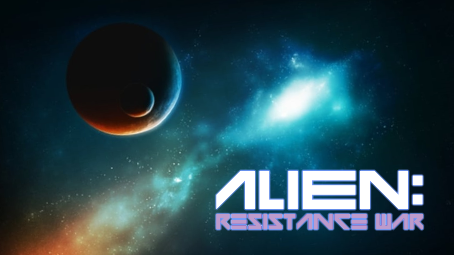
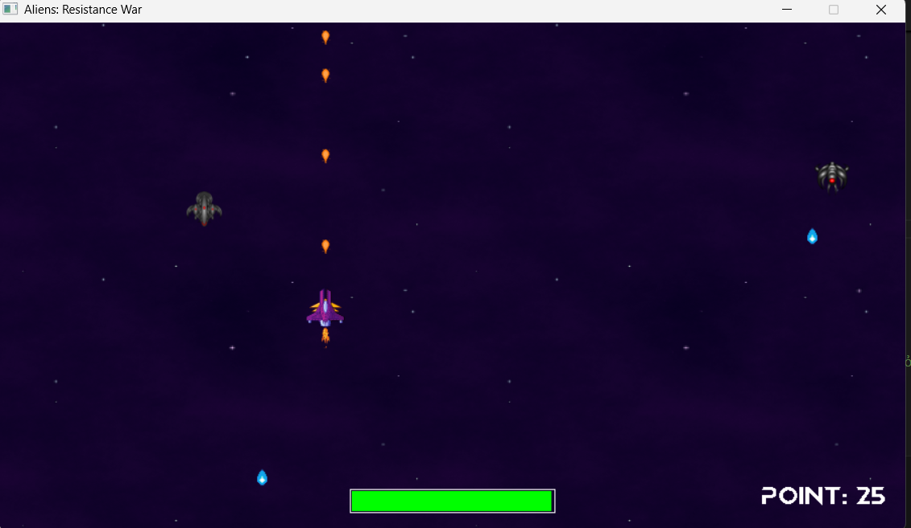
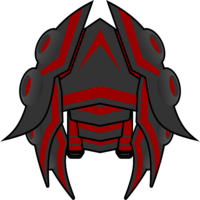
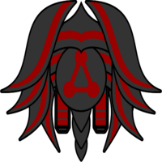
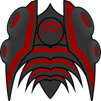
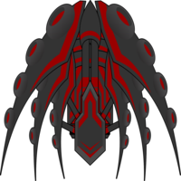
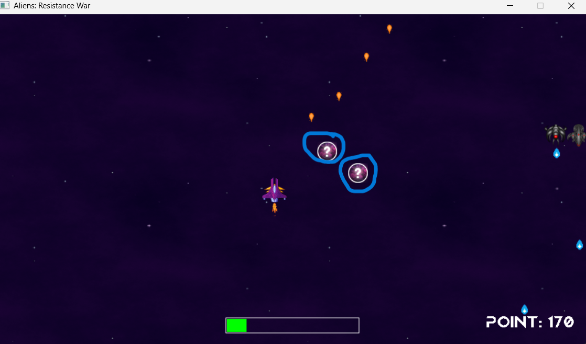
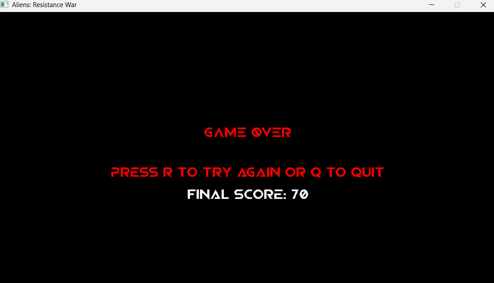
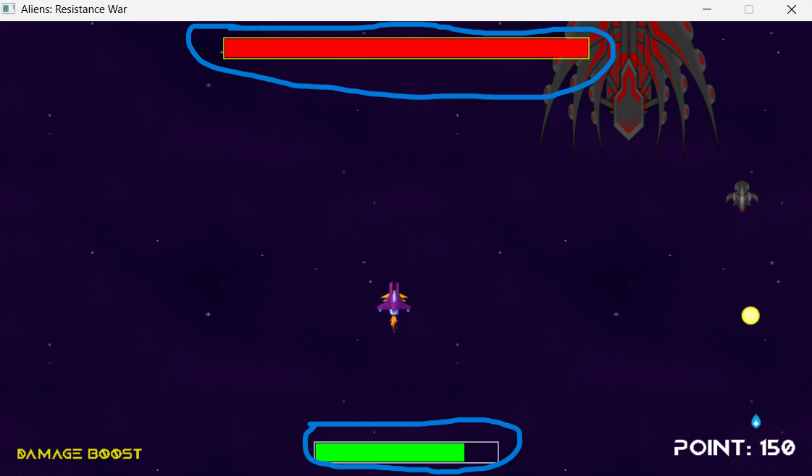
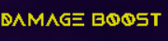

# 🌌 Aliens: Resistance War

# Giới thiệu game
Aliens: Resistance War là một tựa game bắn tàu vũ trụ không gian 2D được phát triển bằng thư viện SDL2. Người chơi sẽ vào vai một phi thuyền đơn độc chiến đấu chống lại các đợt tấn công của người ngoài hành tinh, thiên thạch, boss khổng lồ và các thế lực vũ trụ bí ẩn như hố đen.

# 1. Gameplay:
- Bạn là phi công cuối cùng điều khiển tàu không gian để chiến đấu và sinh tồn
- Bắn hạ enemy và boss để tăng điểm và nhận buff hỗ trợ.
- Đạn địch, thiên thạch, hố đen và những đòn đánh từ boss sẽ khá khó tránh, đòi hỏi phản xạ tốt.
- Trò chơi không có hồi kết, mục tiêu của bạn là đạt điểm càng cao càng tốt.

# 2. Các cơ chế chính:
- Khi bắt đầu game: Có màn hình menu với nút start và background lấy bối cảnh ngoài không gian. Ấn vào nút Play để bắt đầu trò chơi.
  
- Di chuyển & Bắn: Người chơi điều khiển phi thuyền bằng các phím (A, S, D, W) hoặc các phím mũi tên và có thể bắn bằng phím Space với tốc độ di chuyển, tốc độ và sát thương đạn tùy theo buff đang hoạt động.
  
- Kẻ thù: Các loại enemy di chuyển theo các quỹ đạo khác nhau và tấn công bằng đạn. Càng về sau, game sẽ có boss xuất hiện với kỹ năng và cách tấn công đặc biệt.
  
  
  
  
  
- Boss Fight: Boss xuất hiện định kỳ sau mỗi 30–60 giây và có thanh máu riêng trên màn hình. Có bốn loại boss với các phương thức tấn công khác nhau:
  +  Boss 1: bắn loạt đạn tỏa ra các hướng với giới hạn góc 180 độ về phía dưới.
  +  Boss 2: bắn đạn lớn về phía player, gây sát thương cao.
  +  Boss 3: bắn 3 viên đạn đuổi player trong khoảng thời gian ngắn.
  +  Boss 4: bắn đạn nảy bốn lần rồi mới ra khỏi màn hình.
- Meteor & Black Hole: Thiên thạch rơi ngẫu nhiên gây sát thương và hố đen xuất hiện định kỳ làm chậm người chơi, gây khó khăn trong di chuyển.
  
  
- Buff hệ thống: Tiêu diệt kẻ thù có thể rơi ra buff hỗ trợ với các hiệu ứng như:
  
  + HEAL: Hồi máu
  + SHIELD: Khiên bảo vệ
  + DAMAGE BOOST: Tăng sát thương
  + ATTACK SPEED: Tăng tốc độ bắn
  + UP MAX HP: Tăng máu tối đa
  + REFLECT: Phản lại đạn địch
  + FREEZE: Đóng băng enemy
  + SPEED BOOST: Tăng tốc di chuyển
- Khi player bị tiêu diệt, người chơi có thể chọn R để tiếp tục hoặc Q để thoát.
  

# 3.  Tính năng khác
- Thanh máu động cho cả Player và Boss.
  
- Hiệu ứng lửa động phía dưới phi thuyền.
- Hiển thị điểm số và buff đang kích hoạt (+5 điểm khi tiêu diệt enemy, +20 điểm khi tiêu diệt boss).
  
  
- Xử lý va chạm thông minh cho đạn, địch, buff, thiên thạch, hố đen...
- Hiệu ứng kết thúc Game Over với điểm số và hướng dẫn thao tác tiếp theo.

# 4. Về Source code:
- 📂 draw:
  + Khởi tạo cửa sổ và renderer
  + Sử dụng SDL_CreateWindow và SDL_CreateRenderer để tạo cửa sổ và renderer.
  + Sử dụng các thư viện của SDL2
  + Bao gồm: SDL2, SDL2_image, SDL2_ttf, SDL2_mixer.
  + Dùng để: load ảnh (IMG_Load, SDL_CreateTextureFromSurface), font chữ (TTF_OpenFont, TTF_RenderText_Solid), âm thanh (Mix_LoadWAV, Mix_PlayChannel).
  + Vẽ lên màn hình
  + Gồm các hàm như renderScore, renderHealthBar, renderGameOver, renderBuffText để vẽ các đối tượng UI và trạng thái game.
    
- 📂 elements:
  + `Player: điều khiển tàu vũ trụ người chơi, xử lý buff, máu, va chạm.
  + `Bullet` / `EnemyBullet` / `Type0~3Bullet`: quản lý đạn của player, boss, enemy.
  + `Enemy`: kẻ địch thông thường, có di chuyển và tấn công.
  + `Boss`: boss đặc biệt, nhiều loại với kiểu tấn công riêng.
  + `Meteor`: thiên thạch rơi từ bốn phía.
  + `BlackHole`: hố đen làm chậm player và gây sát thương.
  + `Fire`: hiệu ứng lửa phía sau tàu.
  + `Buff`: hiệu ứng hỗ trợ (tăng tốc, hồi máu, phản đạn...).
  + Tất cả các thành phần trên được quản lý bằng các vector và được update/render mỗi khung hình.

- 📂 elements_actions:
  Xử lý tương tác giữa các thành phần
  + Va chạm giữa đạn và enemy, boss.
  + Player nhặt buff, chịu sát thương từ bullet, meteor, black hole.
  + Hàm `spawn` tạo enemy mới khi số lượng < 5.
  + `bossSpawning` sinh boss theo thời gian ngẫu nhiên.
  + `spawnMeteor`, `spawnBlackHole` tạo thiên thạch và hố đen sau thời gian định sẵn.
  Quản lý buff
  + `applyBuffToPlayer` dùng để kích hoạt hiệu ứng buff lên player.
  + Buff có thời gian hiệu lực, hiển thị chữ thông báo ngắn.

- 📂 events:
  Xử lý sự kiện bàn phím và game loop chính
  + Nhấn phím để di chuyển tàu (`handleEvent` của `Player`).
  + Bắn đạn bằng phím `SPACE`.
  + Menu chọn bắt đầu chơi (`Menu`), hoặc trở lại khi thua (`R` để chơi lại, `Q` để thoát).
  
  Quản lý vòng lặp game
  + Vòng lặp chính chạy `while (!quit)` để xử lý mọi frame.
  + Phân nhánh giữa hiển thị menu (`menu.menuOrGame()`) và gameplay.

- 📂 music:
  Xử lý âm thanh
  + `gSound`: âm thanh bắn trúng.
  + `endGame`: âm thanh thua cuộc.
  + Dùng `Mix_LoadWAV`, `Mix_PlayChannel`, `Mix_VolumeChunk`.

- 📂 player:
  Xử lý dữ liệu người chơi
  + Biến `playerPoint`: điểm số hiện tại.
  + `Player`: lớp xử lý buff, máu, sát thương, phản đạn.

- `game.hpp`  và  `game.cpp`:
  + Chứa `main()` – hàm khởi tạo game, chạy vòng lặp chính, vẽ, xử lý sự kiện, kết thúc game.

# 🔽 Download & Play

👉 [Click here to download the game (Windows)](https://github.com/ledinhdung2604/Aliens-Resistance-War/releases/download/v1.0/Aliens-Resistance-War.zip)

- Đường link tải game trên bao gồm cả source code và file chạy game.

- Xử lí sau khi tải game từ đường link trên:
1. Giải nén file `.zip`
2. Chạy `main.exe`
3. Play!
